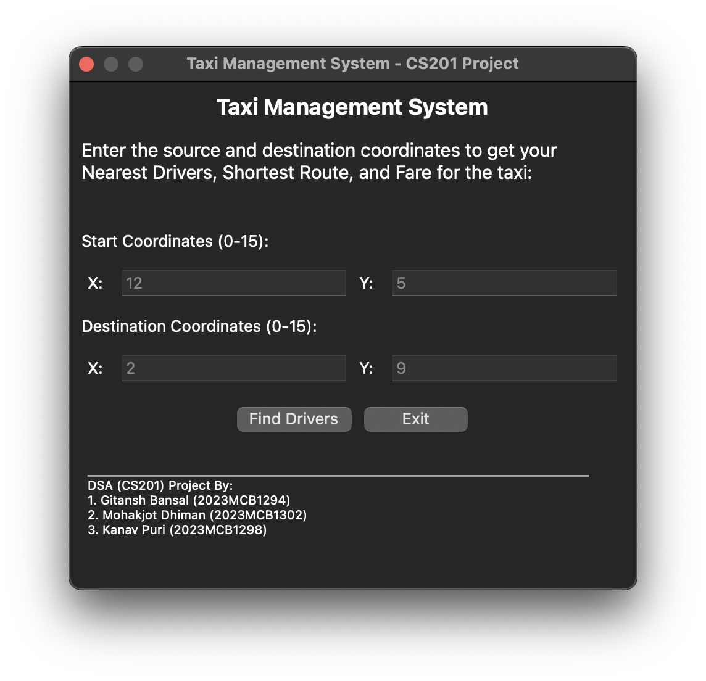
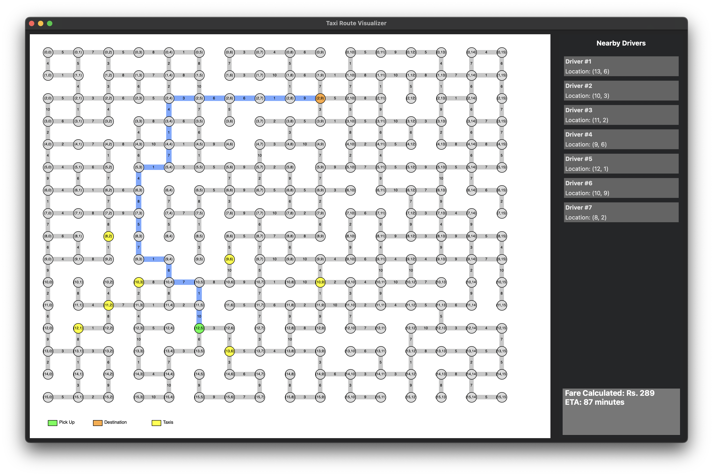

# Taxi Management System (CS201 Project) (Group 23)

A C++ application that simulates a taxi routing and management system using **van Emde Boas Trees** and **Dijkstra's algorithm** to find optimal routes and nearby drivers.

---

## Features

- **Interactive GUI** for location input
- **Real-time route calculation and visualization**
- **Nearby driver detection**
- **Fare estimation**
- **Visual representation** of pickup points, destinations, available taxis and shortest route

---

## Screenshots
- Location Input Window
  <div align="center">
  
  </div>
- Route Visualization Window
  <div align="center">
  
  </div>

---

## Dependencies

- wxWidgets (GUI framework)
- C++ Standard Library
- Standard Template Library (STL)

---

## Build Requirements

- C++ Compiler with C++11 support
- wxWidgets 3.0 or later

---

## Some Points to Note
1. The code zip file contains two codes- "final_code_GUI.cpp" and "final_code_console.cpp", and two text files.
2. The codes are same, except the former supports Graphical User Interface while the latter only gives output in the console/terminal.
3. To run the code "final_code_GUI.cpp", installation of the "wxWidgets" library is necessary, whereas the other code can be run as it is.
4. The text files must be present in the same directory as the codes.
5. Some parametes like the Universe Size, file paths, driver search area etc. can be changed in the starting of the code where all these are defined.

---
## Quick Start

### Install wxWidgets


#### Ubuntu/Debian
```bash
sudo apt-get install libwxgtk3.0-dev
```

#### macOS
```bash
brew install wxwidgets
```

### Windows
For installing on windows, visit https://www.wxwidgets.org/downloads/


---
## Build and Run
Navigate to the project folder and use the following commands

For compiling GUI Application:
```bash
g++ -std=c++11 final_code_GUI.cpp `wx-config --cxxflags --libs` -o final_code_GUI
```

For running GUI Application:
```bash
./final_code_GUI
```

For compiling Console Application:
```bash
g++ -std=c++11 final_code_console.cpp -o final_code_console
```

For running GUI Application:
```bash
./final_code_console
```
---
## Usage
1. Keep the text files "drivers.txt" and "graph.txt" in the same directory or write their paths in the code file where the constants "driver_file" and "graph_file" are defined at the top of the code.
2. Run the program
3. Enter pickup and destination coordinates 
4. [For GUI Application] Click "Find Drivers" to view:
    - Available drivers
    - Shortest route
    - Fare estimate and ETA

---

## Contributors

- **Gitansh Bansal** (2023MCB1294)
- **Mohakjot Dhiman** (2023MCB1302)
- **Kanav Puri** (2023MCB1298)

---

## Note
This project was developed as part of the Data Structures and Algorithms (CS201) course. The implementation focuses on demonstrating the practical application of advanced data structures and algorithms in a real-world scenario.

---
